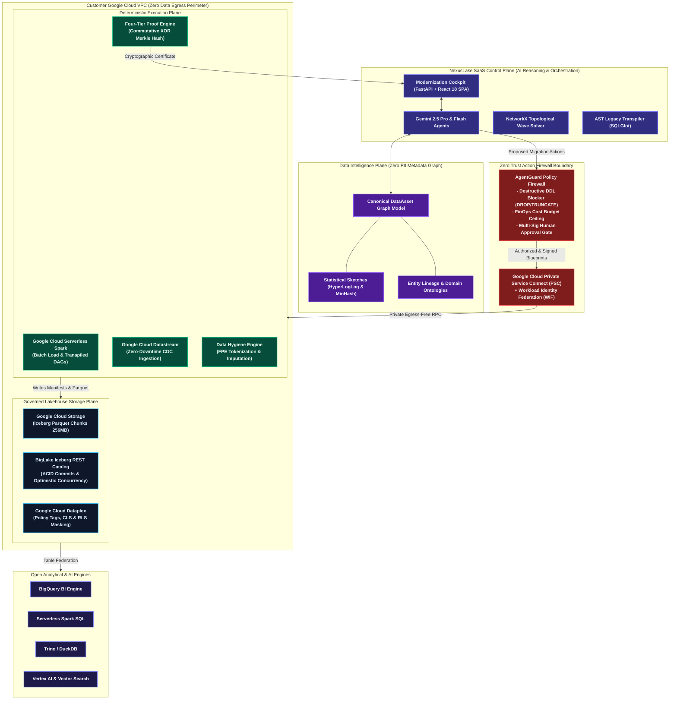
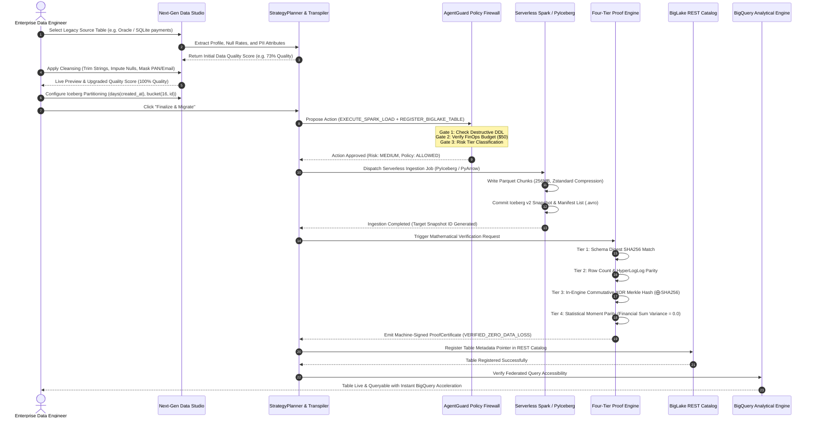
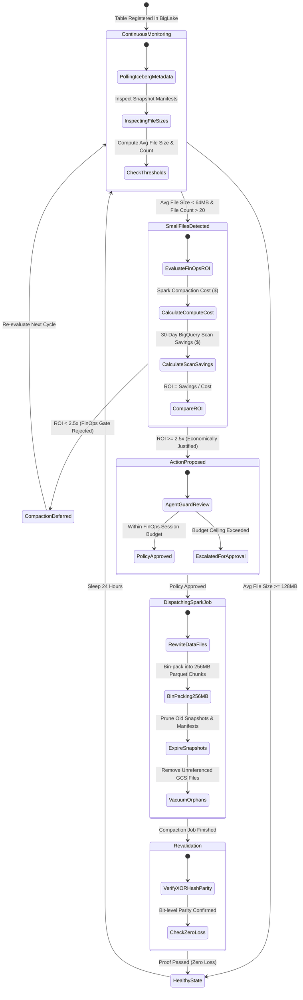

# NexusLake Agentic Architect: Master Visual Suite & Colorful Diagrams for Medium

> **Document Version:** 1.0.0  
> **Purpose:** Colorful architecture diagrams, 12-stage modernization workflow, comprehensive mindmap, and internal working process sequence diagrams for publication in Medium articles, technical whitepapers, and architecture reviews.  
> **Image Asset Included:** High-resolution architectural infographic available at `nexuslake_architecture_infographic.jpg`.

---

## Visual Table of Contents
1. [Executive Infographic Asset Preview](#1-executive-infographic-asset-preview)
2. [Diagram 1: The 12-Stage Modernization Workflow (Vibrant Flowchart)](#2-diagram-1-the-12-stage-modernization-workflow-vibrant-flowchart)
3. [Diagram 2: Complete 4-Plane Architecture & Zero-Egress VPC (System Flowchart)](#3-diagram-2-complete-4-plane-architecture--zero-egress-vpc-system-flowchart)
4. [Diagram 3: NexusLake Architectural Mindmap (Radial Tree Structure)](#4-diagram-3-nexuslake-architectural-mindmap-radial-tree-structure)
5. [Diagram 4: Internal Working Process (End-to-End Sequence Diagram)](#5-diagram-4-internal-working-process-end-to-end-sequence-diagram)
6. [Diagram 5: Autonomic Day-2 FinOps & Compaction Cycle (State Process Diagram)](#6-diagram-5-autonomic-day-2-finops--compaction-cycle-state-process-diagram)
7. [How to Use These Diagrams in Your Medium Blog Post](#7-how-to-use-these-diagrams-in-your-medium-blog-post)

---

## 1. Executive Infographic Asset Preview

An infographic has been generated for your blog post and is saved directly in your project root:
- **Local Path:** `nexuslake_architecture_infographic.jpg`
- **Recommended Medium Placement:** Post banner or under Section 2 ("The Architecture Overview").

---

## 2. Diagram 1: The 12-Stage Modernization Workflow (Vibrant Flowchart)

This flowchart illustrates the complete 12-stage modernization lifecycle from heterogeneous legacy sources to an open Apache Iceberg lakehouse on Google Cloud, color-coded by operational phase.

```mermaid
flowchart TD
    classDef cSource fill:#1E293B,stroke:#475569,stroke-width:2px,color:#F8FAFC,font-weight:bold;
    classDef cDisc fill:#2563EB,stroke:#1D4ED8,stroke-width:2px,color:#FFFFFF,font-weight:bold;
    classDef cAssess fill:#4F46E5,stroke:#3730A3,stroke-width:2px,color:#FFFFFF,font-weight:bold;
    classDef cUnder fill:#7C3AED,stroke:#5B21B6,stroke-width:2px,color:#FFFFFF,font-weight:bold;
    classDef cDecide fill:#9333EA,stroke:#6B21A8,stroke-width:2px,color:#FFFFFF,font-weight:bold;
    classDef cDesign fill:#C026D3,stroke:#86198F,stroke-width:2px,color:#FFFFFF,font-weight:bold;
    classDef cClean fill:#059669,stroke:#065F46,stroke-width:2px,color:#FFFFFF,font-weight:bold;
    classDef cTrans fill:#D97706,stroke:#92400E,stroke-width:2px,color:#FFFFFF,font-weight:bold;
    classDef cMigrate fill:#EA580C,stroke:#9A3412,stroke-width:2px,color:#FFFFFF,font-weight:bold;
    classDef cValidate fill:#DC2626,stroke:#991B1B,stroke-width:2px,color:#FFFFFF,font-weight:bold;
    classDef cGovern fill:#DB2777,stroke:#9D174D,stroke-width:2px,color:#FFFFFF,font-weight:bold;
    classDef cOperate fill:#0891B2,stroke:#155E75,stroke-width:2px,color:#FFFFFF,font-weight:bold;
    classDef cVisual fill:#0D9488,stroke:#115E59,stroke-width:2px,color:#FFFFFF,font-weight:bold;
    classDef cTarget fill:#1E3A8A,stroke:#172554,stroke-width:3px,color:#60A5FA,font-weight:bold;

    SRC["Heterogeneous Sources (RDBMS / Warehouses / NoSQL / S3 Lake / Streams)"]:::cSource

    subgraph Phase1["Phase I: Intelligence & Planning"]
        S1["Stage 1: Discover<br/>(EstateDiscoveryAgent)"]:::cDisc
        S2["Stage 2: Assess<br/>(ComplexityAssessmentAgent)"]:::cAssess
        S3["Stage 3: Understand<br/>(SemanticOntologyAgent)"]:::cUnder
        S4["Stage 4: Decide<br/>(StrategyPlannerAgent)"]:::cDecide
        S5["Stage 5: Design<br/>(IcebergLayoutArchitect)"]:::cDesign
    end

    subgraph Phase2["Phase II: Sanitization & Modernization"]
        S6["Stage 6: Clean & Sanitize<br/>(Data Studio & Dataplex FPE)"]:::cClean
        S7["Stage 7: Transform<br/>(PipelineTranspilerAgent)"]:::cTrans
        S8["Stage 8: Migrate<br/>(Serverless Spark & Datastream CDC)"]:::cMigrate
    end

    subgraph Phase3["Phase III: Verification & Governance"]
        S9["Stage 9: Validate<br/>(4-Tier Merkle Proof Engine)"]:::cValidate
        S10["Stage 10: Govern<br/>(Dataplex Policy Tags & CLS/RLS)"]:::cGovern
    end

    subgraph Phase4["Phase IV: Autonomic Day-2 Operations"]
        S11["Stage 11: Operate<br/>(LakehouseSREAgent & FinOps Compactor)"]:::cOperate
        S12["Stage 12: Visualize<br/>(Modernization Cockpit Dashboard)"]:::cVisual
    end

    TGT["Open Apache Iceberg v2 Lakehouse<br/>(BigLake REST Catalog + BigQuery Queryability)"]:::cTarget

    SRC --> S1
    S1 -->|Schema & Metadata Graph| S2
    S2 -->|Volume & QPS Metrics| S3
    S3 -->|PII Tags & Business Domain| S4
    S4 -->|10-Pattern Strategy & Wave DAG| S5
    S5 -->|Partition Spec & Sort Keys| S6
    S6 -->|Sanitized Dataset & 100% Quality| S7
    S7 -->|Transpiled PySpark DAG & AST| S8
    S8 -->|Iceberg v2 Parquet & Manifests| S9
    S9 -->|Commutative XOR Hash Parity| S10
    S10 -->|Governed Table Policy| TGT
    TGT --> S11
    S11 -->|Compacted 256MB Chunks| S12
    S11 -.->|Continuous Observe-Analyze-Optimize Loop| S11
```



---

## 3. Diagram 2: Complete 4-Plane Architecture & Zero-Egress VPC (System Flowchart)

This diagram details the four architectural planes that decouple AI reasoning from deterministic data processing, enforcing a strict Zero-Egress VPC security boundary.



---

## 4. Diagram 3: NexusLake Architectural Mindmap (Radial Tree Structure)

A structured mindmap illustrating all core facets of the platform—from source connectors to 14 specialized agents, 10 migration strategies, Zero Trust security, and autonomic Day-2 operations.

```mermaid
flowchart LR
    classDef cRoot fill:#1E1B4B,stroke:#818CF8,stroke-width:3px,color:#FFFFFF,font-weight:bold;
    classDef cBranch1 fill:#1E293B,stroke:#3B82F6,stroke-width:2px,color:#93C5FD,font-weight:bold;
    classDef cBranch2 fill:#1E293B,stroke:#8B5CF6,stroke-width:2px,color:#C4B5FD,font-weight:bold;
    classDef cBranch3 fill:#1E293B,stroke:#10B981,stroke-width:2px,color:#6EE7B7,font-weight:bold;
    classDef cBranch4 fill:#1E293B,stroke:#EF4444,stroke-width:2px,color:#FCA5A5,font-weight:bold;
    classDef cBranch5 fill:#1E293B,stroke:#F59E0B,stroke-width:2px,color:#FCD34D,font-weight:bold;
    classDef cBranch6 fill:#1E293B,stroke:#06B6D4,stroke-width:2px,color:#67E8F9,font-weight:bold;
    classDef cLeaf fill:#0F172A,stroke:#64748B,stroke-width:1px,color:#F1F5F9;

    ROOT["NexusLake Agentic Architect<br/>(Autonomous Iceberg Modernization)"]:::cRoot

    %% Branch 1: Sources
    B_SRC["Heterogeneous Sources"]:::cBranch1
    ROOT --> B_SRC
    B_SRC --> S_REL["Relational (Oracle, DB2, Postgres, SQL Server)"]:::cLeaf
    B_SRC --> S_DW["Data Warehouses (Teradata, Snowflake, Redshift)"]:::cLeaf
    B_SRC --> S_NOSQL["NoSQL & JSON (MongoDB, Cassandra, DynamoDB)"]:::cLeaf
    B_SRC --> S_LAKE["Legacy Lakes (AWS S3, GCS Parquet/ORC, CSV)"]:::cLeaf
    B_SRC --> S_STREAM["Streaming (Kafka, Cloud Pub/Sub, Datastream)"]:::cLeaf
    B_SRC --> S_MEDIA["Multimodal Media (PDFs, Audio Calls, Images)"]:::cLeaf

    %% Branch 2: Agents
    B_AGENTS["14 Specialized Agents"]:::cBranch2
    ROOT --> B_AGENTS
    B_AGENTS --> A_DISC["EstateDiscoveryAgent (Deep Profiler)"]:::cLeaf
    B_AGENTS --> A_STRAT["StrategyPlannerAgent (10-Pattern Engine)"]:::cLeaf
    B_AGENTS --> A_TRANS["PipelineTranspilerAgent (AST to PySpark)"]:::cLeaf
    B_AGENTS --> A_PROOF["MigrationProofEngine (4-Tier Merkle DAG)"]:::cLeaf
    B_AGENTS --> A_SRE["LakehouseSREAgent (FinOps Compactor)"]:::cLeaf
    B_AGENTS --> A_SEC["SecurityComplianceAgent (Dataplex & FPE)"]:::cLeaf
    B_AGENTS --> A_MULTI["MultimodalVectorizerAgent (Vertex AI)"]:::cLeaf

    %% Branch 3: Strategies
    B_STRAT["10 Migration Strategies"]:::cBranch3
    ROOT --> B_STRAT
    B_STRAT --> ST_REG["REGISTER (Zero-Copy Metadata Pointers)"]:::cLeaf
    B_STRAT --> ST_CDC["CDC (Google Cloud Datastream <2s Lag)"]:::cLeaf
    B_STRAT --> ST_REP["REPLICATE (Serverless Spark Batch Load)"]:::cLeaf
    B_STRAT --> ST_TRANS["TRANSFORM (NoSQL Unnesting to Structs)"]:::cLeaf
    B_STRAT --> ST_REW["REWRITE (Sanitization & Dead-Lettering)"]:::cLeaf
    B_STRAT --> ST_PART["REPARTITION (Iceberg Hidden Transforms)"]:::cLeaf
    B_STRAT --> ST_ARCH["ARCHIVE (Cold Storage Tiering to GCS)"]:::cLeaf

    %% Branch 4: Security
    B_SEC["Zero Trust Security"]:::cBranch4
    ROOT --> B_SEC
    B_SEC --> SEC_VPC["Zero-Egress Customer VPC (Raw Data Protected)"]:::cLeaf
    B_SEC --> SEC_GUARD["AgentGuard Firewall (Blocks Destructive DDL)"]:::cLeaf
    B_SEC --> SEC_TAGS["Dataplex Policy Tags (CLS & RLS Governance)"]:::cLeaf
    B_SEC --> SEC_FPE["Format-Preserving Encryption (PAN/Email Masking)"]:::cLeaf
    B_SEC --> SEC_WIF["Workload Identity Federation (Zero JSON Keys)"]:::cLeaf

    %% Branch 5: Verification
    B_VERIF["Four-Tier Proof Engine"]:::cBranch5
    ROOT --> B_VERIF
    B_VERIF --> V_T1["Tier 1: Structural Schema Fingerprint Match"]:::cLeaf
    B_VERIF --> V_T2["Tier 2: Statistical Cardinality & HLL Parity"]:::cLeaf
    B_VERIF --> V_T3["Tier 3: Commutative XOR Merkle Hash (⨁ SHA256)"]:::cLeaf
    B_VERIF --> V_T4["Tier 4: Semantic Financial Moment Parity"]:::cLeaf

    %% Branch 6: Day-2 Ops
    B_OPS["Autonomic Day-2 FinOps"]:::cBranch6
    ROOT --> B_OPS
    B_OPS --> O_ROI["FinOps Compaction ROI Gate (Threshold >= 2.5x)"]:::cLeaf
    B_OPS --> O_BIN["rewrite_data_files (256MB Bin-Packing)"]:::cLeaf
    B_OPS --> O_SNAP["Snapshot Expiration & Orphan File Vacuum"]:::cLeaf
    B_OPS --> O_HEAL["Schema Healer (Safe Evolution vs Quarantine)"]:::cLeaf
```



---

## 5. Diagram 4: Internal Working Process (End-to-End Sequence Diagram)

This sequence diagram depicts the chronological step-by-step lifecycle of migrating a single production table: from extraction and interactive Data Studio cleansing to AgentGuard approval, PyIceberg commit, 4-tier verification, and BigLake registration.



---

## 6. Diagram 5: Autonomic Day-2 FinOps & Compaction Cycle (State Process Diagram)

This state diagram models the continuous autonomic Day-2 optimization loop running in the background post-migration.



---

## 7. How to Use These Diagrams in Your Medium Blog Post

### Option 1: One-Click SVG/PNG Export via the Interactive HTML Viewer
We have built an accompanying interactive visualizer:
```
diagrams_interactive_viewer.html
```
1. Double-click `diagrams_interactive_viewer.html` to open it in Google Chrome or Microsoft Edge.
2. Every diagram above is rendered in high-definition SVG vector format with custom dark/light theme styling.
3. Click the **"Export SVG"** or **"Copy as PNG"** button directly beneath any diagram, and paste it straight into Medium's image uploader!

### Option 2: Embed the Generated Infographic Banner
Use the generated graphic:
- Filename: `nexuslake_architecture_infographic.jpg`
- Upload this image directly as the Medium story header or architectural spotlight graphic.

### Option 3: Direct Markdown Copy
If you use markdown platforms that support Mermaid (such as GitHub, Dev.to, Hashnode, or GitBook), you can copy and paste the raw Mermaid code blocks directly.
