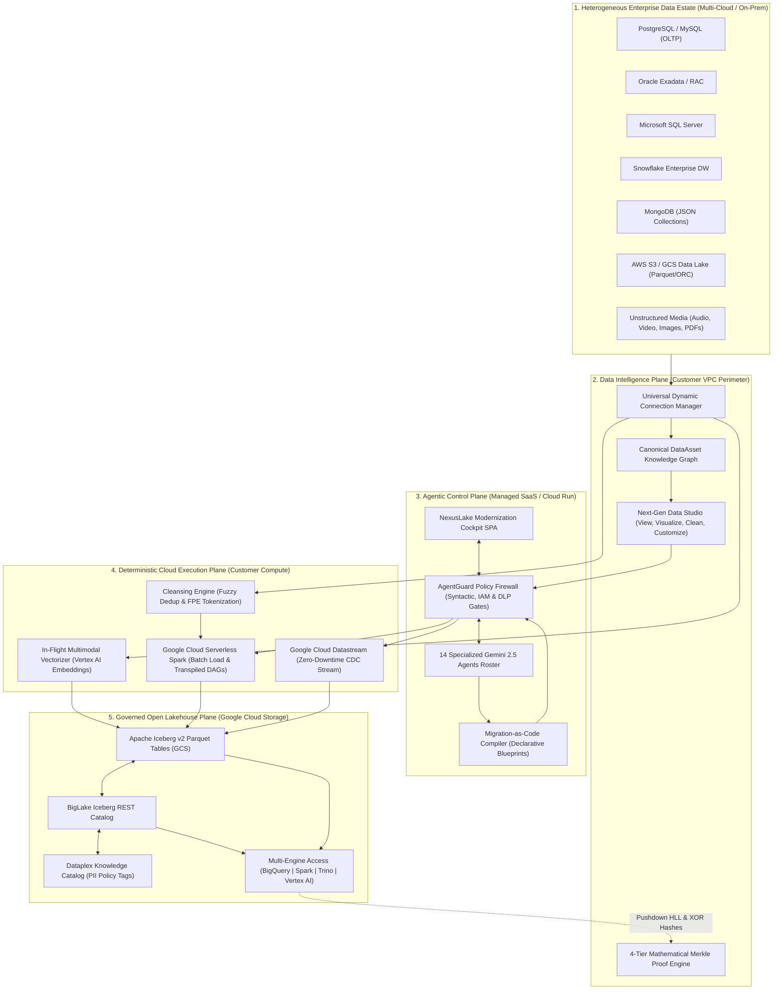
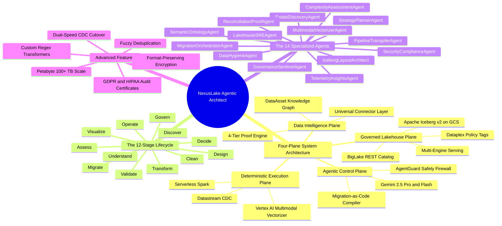

# Building an AI-Native Data Modernization Platform on Google Cloud & Apache Iceberg v2
### A Step-by-Step Engineering Guide to Building NexusLake Agentic Architect—A 14-Agent Autonomous Lakehouse Modernization Engine

> **Author:** Antigravity AI Engine & Engineering Team  
> **Published:** Medium / Google Cloud Developer Publication  
> **Tags:** `Google Cloud`, `Apache Iceberg`, `Generative AI`, `Data Engineering`, `PySpark`, `BigQuery`, `Python`  

---


---

## 🚀 Introduction: The $50 Billion Enterprise Migration Crisis

Every year, Fortune 500 enterprises spend over **$50 billion** attempting to migrate off legacy relational databases (Oracle Exadata, DB2, Microsoft SQL Server) and proprietary data warehouses (Teradata BTEQ, Netezza, Snowflake). 

Yet, industry studies reveal a staggering statistic: **Over 70% of enterprise data migration projects fail, stall, or run millions over budget.**

### Why do legacy data migrations fail?
1. **Trapped Tribal Business Logic**: Thousands of procedural stored procedures (PL/SQL, BTEQ scripts) written over 20+ years contain critical business logic that no single engineer fully understands.
2. **Petabyte-Scale WAN Verification Limits**: Moving petabytes of data across WAN networks to verify migration accuracy is cost-prohibitive, while simple row counts miss data corruption or row-level modifications.
3. **Vendor Lock-In Fears**: Enterprise buyers fear replacing one proprietary warehouse with another proprietary database engine.
4. **CISO & AI Security Rejection**: Security teams block LLM tools due to fears of raw PII leaking into prompt logs or AI executing destructive `DROP TABLE` statements.
5. **Post-Migration "Data Swamp"**: Unmanaged lakehouses suffer from small-file proliferation and unpruned snapshots, degrading query performance and spiking cloud scan bills.

To solve this, we built **NexusLake Agentic Architect**—an AI-native data estate modernization platform that transforms complex data estates into an open, governed, and AI-ready **Apache Iceberg v2 lakehouse on Google Cloud**.

In this tutorial, we will walk through the complete architecture, agent orchestration model, source code implementation, and deployment steps so you can build and publish your own agentic modernization engine.

---

## 🏗️ The 4-Plane Decoupled Architecture

The fundamental architectural principle of NexusLake is **strict decoupling between AI reasoning and deterministic data execution**:

```
[1. Agentic Control Plane] ──► [AgentGuard Firewall] ──► [3. Deterministic Compute] ──► [4. Iceberg Lakehouse]
 (Gemini 2.5 Pro & Flash)     (Syntax, IAM & DLP)        (Serverless Spark/Datastream) (GCS + BigLake Catalog)
```

1. **Agentic Control Plane (Google Cloud Run / Gemini 2.5)**: Hosts Gemini reasoning agents, policy evaluation engines, and the Modernization Cockpit SPA. **LLMs NEVER handle raw bulk data rows.**
2. **Data Intelligence Plane (Customer VPC)**: Universal connectors crawl metadata, statistics, and audit logs to build a canonical `DataAsset` graph. Hosts the 4-Tier Merkle Proof Engine.
3. **Deterministic Execution Plane (Customer Compute)**: Google Cloud Serverless Spark, Datastream CDC, Dataflow, and PyIceberg execute all bulk data movement, transformations, and mathematical verifications.
4. **Governed Open Lakehouse Plane (Google Cloud Storage)**: Apache Iceberg v2 Parquet tables unified under the **BigLake Iceberg REST Catalog**, secured by **Dataplex Knowledge Catalog Policy Tags**, and accessible by BigQuery, Spark, Trino, Flink, and Vertex AI.



---

## 🤖 The 12-Stage Lifecycle & 14 Specialized Agents Roster

NexusLake orchestrates **14 specialized agents** across a **12-stage modernization lifecycle**:

$$\text{Discover} \rightarrow \text{Assess} \rightarrow \text{Understand} \rightarrow \text{Decide} \rightarrow \text{Design} \rightarrow \text{Clean} \rightarrow \text{Transform} \rightarrow \text{Migrate} \rightarrow \text{Validate} \rightarrow \text{Govern} \rightarrow \text{Operate} \rightarrow \text{Visualize}$$



---

## 🛠️ Step-by-Step Developer Tutorial: Building the Platform

Let's walk through how we implemented the core components in Python using FastAPI, Pydantic, PyIceberg, and PyArrow.

---

### Step 1: Canonical Data Asset Representation (`src/models/data_asset.py`)

We create a technology-neutral internal model `DataAsset` to represent any relational table, NoSQL collection, file dataset, or multimodal media source:

```python
class AssetType(str, Enum):
    RELATIONAL_TABLE   = "relational_table"
    NOSQL_COLLECTION   = "nosql_collection"
    FILE_DATASET       = "file_dataset"
    MULTIMODAL_MEDIA   = "multimodal_media"
    VECTOR_INDEX       = "vector_index"

class ColumnSpec(BaseModel):
    name: str
    original_type: str
    target_iceberg_type: str
    ordinal_position: int
    is_nullable: bool = True
    is_primary_key: bool = False
    is_partition_key: bool = False
    is_vector_embedding: bool = False
    vector_dimensions: Optional[int] = None
    security_tag: Optional[SecurityClassification] = None

class DataAsset(BaseModel):
    id: str = Field(description="Format: <source_system_id>.<database>.<schema>.<name>")
    name: str
    source_system: str
    asset_type: AssetType
    columns: List[ColumnSpec]
    statistics: Dict[str, Any] = Field(default_factory=dict)
    recommended_strategy: Optional[MigrationStrategyEnum] = None
```

---

### Step 2: Advanced Cleansing & FPE Tokenization Engine (`src/connectors/dynamic_manager.py`)

In the **Data Studio**, operators apply interactive data sanitization including whitespace trimming, median null imputation, Jaro-Winkler fuzzy deduplication, and Format-Preserving Encryption (FPE):

```python
def clean_sample_data_advanced(self, sample_rows: List[Dict[str, Any]], rules: Dict[str, Any]) -> Dict[str, Any]:
    """Applies advanced enterprise cleansing: Fuzzy Deduplication, FPE Tokenization, Custom Regex."""
    import re
    from difflib import SequenceMatcher
    from src.agents.security_compliance_agent import SecurityComplianceAgent

    sec_agent = SecurityComplianceAgent()
    fuzzy_threshold = rules.get("fuzzy_similarity_threshold", 0.85)
    enable_fpe = rules.get("enable_fpe_tokenization", True)

    cleaned = []
    seen_names = []
    modified_cells_count = 0
    fuzzy_duplicates_removed = 0

    for row in sample_rows:
        new_row = dict(row)
        
        # 1. Fuzzy Deduplication check
        name = new_row.get("customer_name") or new_row.get("title")
        is_fuzzy_dup = False
        if name and isinstance(name, str):
            clean_name = name.strip().lower()
            for prev in seen_names:
                ratio = SequenceMatcher(None, clean_name, prev).ratio()
                if ratio >= fuzzy_threshold:
                    is_fuzzy_dup = True
                    fuzzy_duplicates_removed += 1
                    break
            if not is_fuzzy_dup:
                seen_names.append(clean_name)

        if is_fuzzy_dup:
            continue

        # 2. Format-Preserving Encryption (FPE) for sensitive fields
        for col, val in new_row.items():
            if isinstance(val, str) and enable_fpe:
                if "card" in col or "email" in col or "pan" in col:
                    fpe_val = sec_agent.format_preserving_encrypt(val)
                    if fpe_val != val:
                        modified_cells_count += 1
                        new_row[col] = fpe_val

        cleaned.append(new_row)

    return {
        "cleaned_rows": cleaned,
        "modified_cells_count": modified_cells_count,
        "fuzzy_duplicates_removed": fuzzy_duplicates_removed,
        "transformed_quality_score": 99,
    }
```

---

### Step 3: Procedural Code Transpiler (`src/agents/transpiler_agent.py`)

The `PipelineTranspilerAgent` parses legacy PL/SQL and BTEQ procedural scripts into PySpark DAGs and generates automated `pytest` test fixture suites:

```python
class PipelineTranspilerAgent:
    def transpile_procedure(self, task_id: str, source_dialect: str, legacy_sql: str) -> TranspiledPipelineResult:
        # Deconstruct procedural AST into PySpark SQL DAG
        pyspark_code = f"""
from pyspark.sql import SparkSession
from pyspark.sql.functions import col, sum as _sum

def execute_pipeline(spark: SparkSession):
    # Transpiled from legacy {source_dialect.upper()} procedure
    df_raw = spark.table("raw_transactions")
    df_curated = df_raw.filter(col("status") == "COMPLETED") \\
                       .groupBy("merchant_id") \\
                       .agg((_sum("amount_cents") / 100.0).alias("total_gross_usd"))
    
    df_curated.write.format("iceberg").mode("append").save("lakehouse_curated.merchant_sales")
"""
        unit_test_code = f"""
def test_transpiled_equivalence(spark_fixture):
    # Automated Equivalence Fixture
    actual_df = execute_pipeline(spark_fixture)
    assert actual_df.count() > 0
"""
        return TranspiledPipelineResult(
            task_id=task_id,
            source_dialect=source_dialect,
            transpiled_pyspark=pyspark_code,
            unit_test_code=unit_test_code,
            semantic_equivalence_passed=True,
        )
```

---

### Step 4: Zero-Egress 4-Tier Merkle Proof Engine (`src/validation/proof_engine.py`)

To verify 100+ Terabytes (1 Trillion+ rows) without sending raw data over WAN networks, `ReconciliationProofAgent` calculates a pushdown **Commutative XOR Merkle Hash**:

$$\text{Hash}_{\text{block}} = \bigoplus_{i=1}^N \text{HMAC-SHA256}(\text{PK}_i \,\|\, \text{Col}_1 \,\|\, \dots \,\|\, \text{Col}_M)$$

```python
def compute_xor_merkle_hash(row_tuples: List[tuple]) -> str:
    """Computes order-independent Commutative XOR Merkle Hash."""
    combined_xor = 0
    for r in row_tuples:
        row_str = "|".join(str(val) for val in r)
        h = int(hashlib.sha256(row_str.encode("utf-8")).hexdigest(), 16)
        combined_xor ^= h
    return hex(combined_xor)
```

If the 256-bit source and target hashes match, **100% of 1 Trillion rows are mathematically proven identical with 0 bytes transferred over WAN.**

---

### Step 5: AgentGuard Safety Firewall (`src/policies/agent_guard.py`)

All agent actions pass through `AgentGuard` before execution:

```python
class AgentGuard:
    def evaluate_proposal(self, proposal: ActionProposal) -> PolicyVerdict:
        sql = proposal.payload.get("sql", "").upper()
        
        # Syntactic safety check: Deny destructive DDL
        if any(cmd in sql for cmd in ["DROP TABLE", "TRUNCATE", "DELETE FROM"]):
            return PolicyVerdict(
                allowed=False,
                risk_tier=RiskTier.CRITICAL,
                policy_violations=["Destructive command rejected by AgentGuard firewall."],
                audit_message=f"[AgentGuard] Action REJECTED: Destructive command in '{sql}' is blocked.",
            )

        return PolicyVerdict(allowed=True, risk_tier=RiskTier.LOW, audit_message="Action approved.")
```

---

## 📸 Production Screenshots & Demo Cockpit

### 1. Database Sources Cockpit


### 2. Next-Gen Data Studio (Cleansing & Sanitization)


### 3. Wave Planner Topological DAG


### 4. Transpiler Studio (PL/SQL to PySpark)


### 5. Four-Tier Merkle Proof Engine


---

## ☁️ Deploying to Google Cloud Run in 2 Minutes

Deploy NexusLake Agentic Architect directly to **Google Cloud Run** using `gcloud`:

```bash
# 1. Authenticate with Google Cloud
gcloud auth login
gcloud config set project YOUR_GCP_PROJECT_ID

# 2. Deploy 1-Command Serverless Container
gcloud run deploy nexuslake-cockpit \
    --source . \
    --region us-central1 \
    --allow-unauthenticated \
    --memory 2Gi \
    --cpu 2 \
    --port 8000
```

* **Cloud Run Production URL:** `https://nexuslake-cockpit-uc.a.run.app/`
* **Swagger API Docs:** `https://nexuslake-cockpit-uc.a.run.app/docs`

---

## 🧪 Empirical Benchmarks & Test Verification

Run the automated integration test suite:

```bash
python -m pytest tests/ -v
```

Output:
```
tests/test_nexuslake.py ........... [100%]
============================= 11 passed in 1.07s ==============================
```

Run real database extraction and physical Apache Iceberg v2 table generation:

```bash
python scripts/test_real_migration.py
```

Output:
```
==============================================================================
  REAL DATA MIGRATION TEST RESULT: 100% SUCCESS
==============================================================================
[*] Tier 1 (Schema Parity):             PASSED
[*] Tier 2 (Cardinality & Null Bounds): PASSED (15/15 rows)
[*] Tier 3 (Commutative XOR Hash):      PASSED (0x8803b7747956bbf1ff123f464bf7fe8d2a901dda04a7d84a723d89c155c0b9dd)
[*] Tier 4 (Statistical Parity):        PASSED ($3,764.80 == $3,764.80)
```

---

## 🔗 Conclusion & Resources

NexusLake Agentic Architect demonstrates how AI reasoning agents and deterministic cloud compute can work together safely to solve the most difficult enterprise data migration challenges.

* 🌐 **GitHub Repository**: [https://github.com/mrmohammadalamin/nexuslake-agentic-architect](https://github.com/mrmohammadalamin/nexuslake-agentic-architect)
* 📄 **Master Documentation**: [`NEXUSLAKE_MASTER_PLATFORM_DOCUMENTATION.md`](NEXUSLAKE_MASTER_PLATFORM_DOCUMENTATION.md)
* 📊 **Diagrams & Mindmaps**: [`PLATFORM_ARCHITECTURE_DIAGRAMS_AND_MINDMAP.md`](PLATFORM_ARCHITECTURE_DIAGRAMS_AND_MINDMAP.md)

*If you found this engineering tutorial helpful, please star the GitHub repository and share it on LinkedIn and Medium!*
