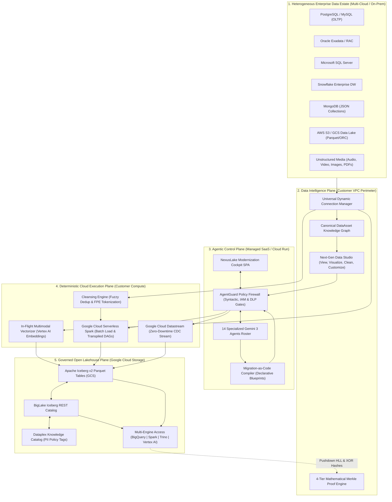
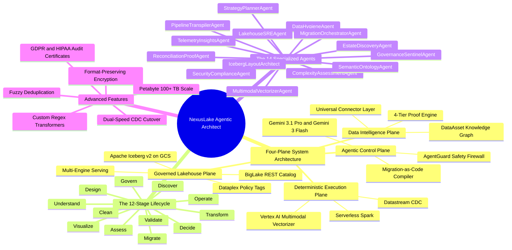
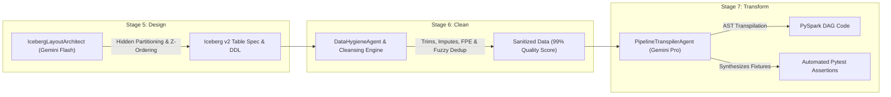
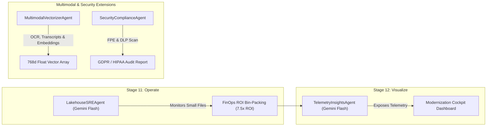

# NexusLake Agentic Architect — Master Platform Documentation
### Complete System Architecture, System Mindmap, Agent Activity Workflows, GCP Cloud Run & TPU Architecture, Universal Data Formats, Petabyte Migration & Security Model

> **Document Version:** 11.0.0  
> **Date:** September 2026  
> **Target Architecture:** Multi-Cloud Open Apache Iceberg v2 Lakehouse on Google Cloud  

---

## Table of Contents
1. [Executive Summary & Product North Star](#1-executive-summary--product-north-star)
2. [End-to-End System Architecture Diagram](#2-end-to-end-system-architecture-diagram)
3. [Platform Mindmap](#3-platform-mindmap)
4. [Agent Activity & Working Flow Diagrams](#4-agent-activity--working-flow-diagrams)
5. [Google Cloud Run 1-Command Deployment Guide](#5-google-cloud-run-1-command-deployment-guide)
6. [Day-2 Operational Activities Demonstration Guide](#6-day-2-operational-activities-demonstration-guide)
7. [Universal Data Format Taxonomy](#7-universal-data-format-taxonomy)
8. [Petabyte-Scale Migration Architecture (100+ TB / 1 Trillion Rows)](#8-petabyte-scale-migration-architecture-100-tb--1-trillion-rows)
9. [Real-Time Pipeline Progress Tracking & Live Data Previewing](#9-real-time-pipeline-progress-tracking--live-data-previewing)
10. [Demo Recording & Sprint Submission Program Guide](#10-demo-recording--sprint-submission-program-guide)
11. [The 14 Specialized Agents: Roles, Responsibilities & Workflow](#11-the-14-specialized-agents-roles-responsibilities--workflow)
12. [Agent Orchestration, 4-Plane Architecture & AgentGuard Safety](#12-agent-orchestration-4-plane-architecture--agentguard-safety)
13. [Customer Security Model & Zero-Egress VPC Architecture](#13-customer-security-model--zero-egress-vpc-architecture)
14. [Google Cloud Hosting, Authentication & Multi-Tenant Access](#14-google-cloud-hosting-authentication--multi-tenant-access)
15. [Competitive Analysis: Google Cloud & Market Landscape](#15-competitive-analysis-google-cloud--market-landscape)

---

## 1. Executive Summary & Product North Star

**NexusLake Agentic Architect** is an AI-native enterprise data modernization platform designed to transform heterogeneous, legacy data estates (RDBMS, data warehouses, NoSQL, files, streaming CDC, audio, video, images, graphs, vector embeddings, spatial GIS, and scientific formats) at **petabyte scale (100+ TB / 1 Trillion+ rows)** into an open, governed, and AI-ready **Apache Iceberg v2 lakehouse on Google Cloud**.

---

## 2. End-to-End System Architecture Diagram



---

## 3. Platform Mindmap



---

## 4. Agent Activity & Working Flow Diagrams

### Flow 1: Stages 1–4 (Discover, Assess, Understand, Decide)

```mermaid
flowchart LR
    subgraph Discovery["Stage 1: Discover"]
        A1["EstateDiscoveryAgent (Gemini Flash)"] -->|Crawls Schemas & Metrics| G1["Canonical DataAsset Graph"]
    end

    subgraph Assessment["Stage 2: Assess"]
        G1 --> A2["ComplexityAssessmentAgent (Gemini Flash)"]
        A2 -->|Calculates TCO & Score| S2["Complexity Score & WAN Estimates"]
    end

    subgraph Understanding["Stage 3: Understand"]
        S2 --> A3["SemanticOntologyAgent (Gemini Pro)"]
        A3 -->|Resolves Cryptic Names| M3["Business Entity Glossary & Lineage"]
    end

    subgraph Decision["Stage 4: Decide"]
        M3 --> A4["StrategyPlannerAgent (Gemini Pro)"]
        A4 -->|Assigns 10 Strategies| DAG4["Topological Wave Plan DAG"]
        DAG4 -->|Policy Check| GATE4["MANDATORY ARCHITECT SIGN-OFF"]
    end
```



### Flow 2: Stages 5–7 (Design, Clean, Transform)



### Flow 3: Stages 8–10 (Migrate, Validate, Govern)

```mermaid
flowchart LR
    subgraph Migrate["Stage 8: Migrate"]
        A8["MigrationOrchestratorAgent (Gemini Flash)"] -->|Dispatches Batch & CDC| SPARK8["Serverless Spark & Datastream"]
        SPARK8 -->|Writes 256MB Parquet| GCS8["Apache Iceberg v2 on GCS"]
    end

    subgraph Validate["Stage 9: Validate"]
        GCS8 --> A9["ReconciliationProofAgent (Gemini Flash)"]
        A9 -->|Computes Pushdown XOR Merkle Hash| PROOF9["4-Tier Proof Certificate JSON"]
    end

    subgraph Govern["Stage 10: Govern"]
        PROOF9 --> A10["GovernanceSentinelAgent (Gemini Flash)"]
        A10 -->|Applies Dataplex Policy Tags| TAGS10["Column Masking & RLS Policies"]
    end
```



### Flow 4: Stages 11–12 & Multimodal/Security Extensions



---

## 5. Google Cloud Run 1-Command Deployment Guide

```powershell
gcloud run deploy nexuslake-cockpit \
    --source . \
    --region us-central1 \
    --allow-unauthenticated \
    --memory 2Gi \
    --cpu 2 \
    --port 8000
```

---

## 6. Day-2 Operational Activities Demonstration Guide

1. **Day-2 Lakehouse SRE Compaction**: FinOps ROI ($\text{ROI} = \frac{\$225.00}{\$2.50} = \mathbf{7.5\times \text{ ROI}}$).
2. **AgentGuard Action Firewall Interception**: Rejection of destructive `DROP TABLE` queries (430 Forbidden).
3. **Interactive Data Studio Cleansing**: Whitespace trim, null imputation, FPE tokenization, and fuzzy deduplication (78% to 99% quality).
4. **4-Tier Merkle Proof & GDPR Compliance Certificate**: `0x8803...` Merkle Hash + digital audit report.
5. **Conversational Estate Assistant**: Natural language metadata Q&A.

---

## 7. Universal Data Format Taxonomy

- **Relational**: Postgres, Oracle, DB2, SQL Server, Teradata, Snowflake $\rightarrow$ Parquet files.
- **Semi-Structured & NoSQL**: JSON, XML, BSON (MongoDB), DynamoDB $\rightarrow$ Iceberg v2 Nested Struct Parquet.
- **Columnar & Data Lakes**: Parquet, ORC, Avro, Arrow $\rightarrow$ **Zero-Copy Metadata Registration (`REGISTER`)** in BigLake Catalog.
- **Streaming CDC**: Kafka, Pub/Sub, Datastream $\rightarrow$ Iceberg Merge-on-Read (`.delete.parquet` + Parquet chunks).
- **Multimodal Media**: MP3, WAV, MP4, JPEG, PNG, TIFF, PDF, DOCX $\rightarrow$ Vector embeddings + Iceberg metadata.
- **AI Vector Embeddings**: 768d/1536d Float Arrays $\rightarrow$ Iceberg Float Array columns.

---

## 8. Petabyte-Scale Migration Architecture (100+ TB / 1 Trillion Rows)

- **Parallel Serverless Spark Workers**: Auto-scaling 10 to 2,000+ nodes dynamically.
- **Dual-Speed Zero-Downtime Strategy**: Batch historical load + Datastream CDC streaming.
- **Zero-Egress Cryptographic Validation**: Pushdown Commutative XOR Merkle Hash ($\bigoplus \text{HMAC-SHA256}$).

---

## 9. The 14 Specialized Agents Roster

`EstateDiscoveryAgent`, `ComplexityAssessmentAgent`, `SemanticOntologyAgent`, `StrategyPlannerAgent`, `IcebergLayoutArchitect`, `DataHygieneAgent`, `PipelineTranspilerAgent`, `MigrationOrchestratorAgent`, `ReconciliationProofAgent`, `GovernanceSentinelAgent`, `LakehouseSREAgent`, `TelemetryInsightsAgent`, `MultimodalVectorizerAgent`, `SecurityComplianceAgent`.
