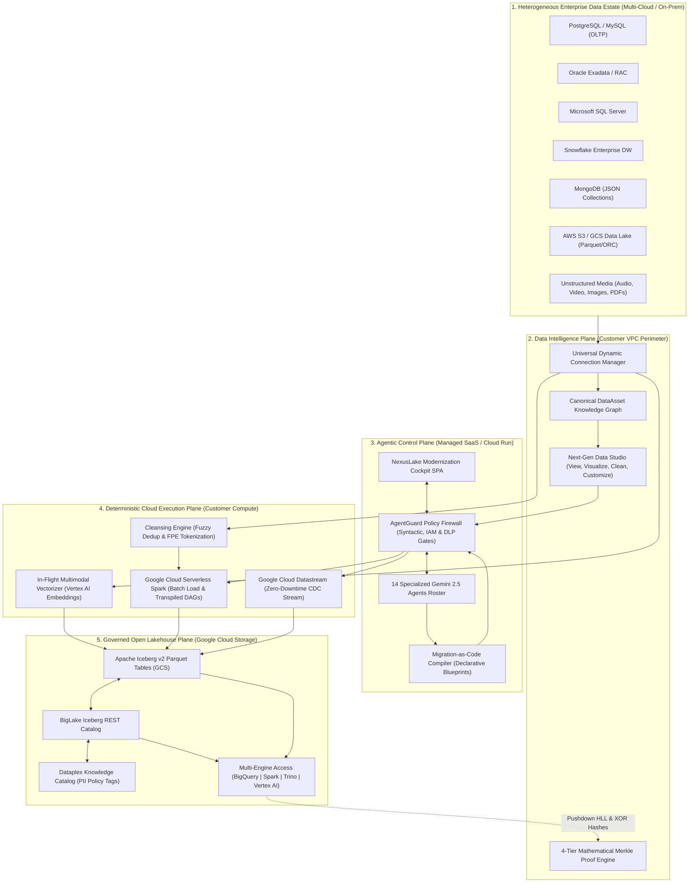
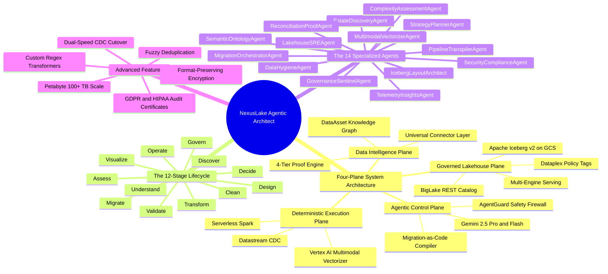
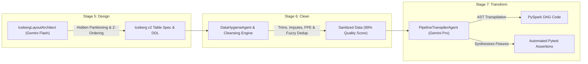
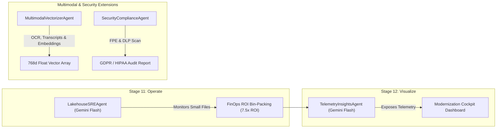

# NexusLake Agentic Architect — System Architecture, Mindmap & Agent Activity Flow Diagrams

> **Document Version:** 1.0.0  
> **Target Architecture:** Multi-Cloud Enterprise Lakehouse Modernization on Google Cloud (Apache Iceberg v2)  

---

## 1. End-to-End System Architecture Diagram

---

## 2. Platform Mindmap

---

## 3. Agent Activity & Working Flow Diagrams

### Flow 1: Stages 1–4 (Discover, Assess, Understand, Decide)

```mermaid
flowchart LR
    subgraph Discovery["Stage 1: Discover"]
        A1["EstateDiscoveryAgent (Gemini Flash)"] -->|Crawls Schemas & Metrics| G1["Canonical DataAsset Graph"]
    end

    subgraph Assessment["Stage 2: Assess"]
        G1 --> A2["ComplexityAssessmentAgent (Gemini Flash)"]
        A2 -->|Calculates TCO & Score| S2["Complexity Score & WAN Estimates"]
    end

    subgraph Understanding["Stage 3: Understand"]
        S2 --> A3["SemanticOntologyAgent (Gemini Pro)"]
        A3 -->|Resolves Cryptic Names| M3["Business Entity Glossary & Lineage"]
    end

    subgraph Decision["Stage 4: Decide"]
        M3 --> A4["StrategyPlannerAgent (Gemini Pro)"]
        A4 -->|Assigns 10 Strategies| DAG4["Topological Wave Plan DAG"]
        DAG4 -->|Policy Check| GATE4["MANDATORY ARCHITECT SIGN-OFF"]
    end
```

---

### Flow 2: Stages 5–7 (Design, Clean, Transform)

---

### Flow 3: Stages 8–10 (Migrate, Validate, Govern)

```mermaid
flowchart LR
    subgraph Migrate["Stage 8: Migrate"]
        A8["MigrationOrchestratorAgent (Gemini Flash)"] -->|Dispatches Batch & CDC| SPARK8["Serverless Spark & Datastream"]
        SPARK8 -->|Writes 256MB Parquet| GCS8["Apache Iceberg v2 on GCS"]
    end

    subgraph Validate["Stage 9: Validate"]
        GCS8 --> A9["ReconciliationProofAgent (Gemini Flash)"]
        A9 -->|Computes Pushdown XOR Merkle Hash| PROOF9["4-Tier Proof Certificate JSON"]
    end

    subgraph Govern["Stage 10: Govern"]
        PROOF9 --> A10["GovernanceSentinelAgent (Gemini Flash)"]
        A10 -->|Applies Dataplex Policy Tags| TAGS10["Column Masking & RLS Policies"]
    end
```

---

### Flow 4: Stages 11–12 & Multimodal/Security Extensions

