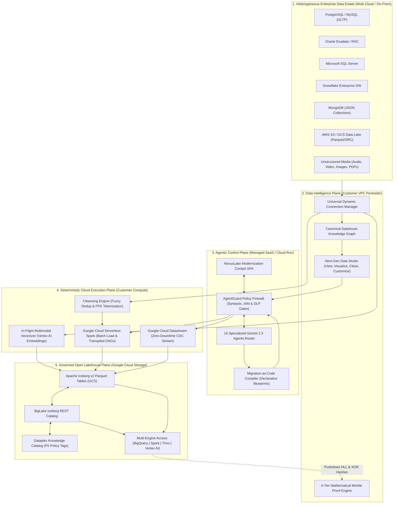
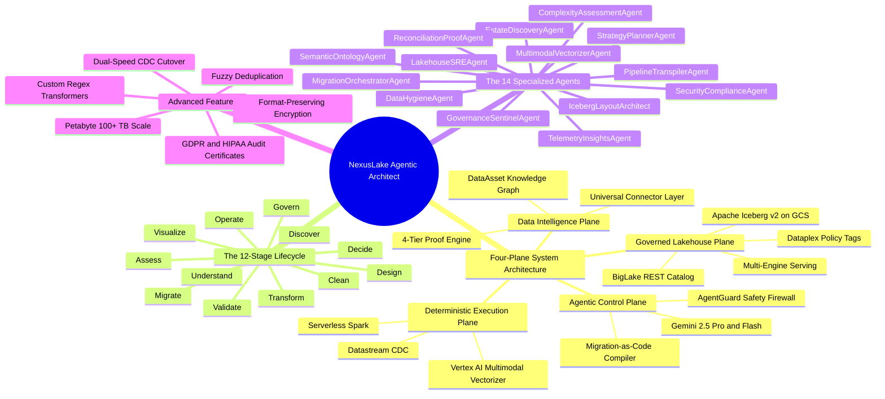

# NexusLake Agentic Architect: Autonomous Data Modernization for Apache Iceberg
### AI-Native Enterprise Data Estate Modernization Platform on Google Cloud

[](https://www.python.org/downloads/)
[](https://react.dev/)
[](https://www.typescriptlang.org/)
[](https://iceberg.apache.org/)
[](https://cloud.google.com/)
[](LICENSE)

---

## 📌 What is NexusLake Agentic Architect?

**NexusLake Agentic Architect** (Agentic Migration Architect) is an AI-native enterprise data modernization platform designed to transform heterogeneous, legacy data estates (RDBMS, data warehouses, NoSQL, files, streaming CDC, audio, video, images, graphs, vector embeddings, spatial GIS, and scientific formats) at **petabyte scale (100+ TB / 1 Trillion+ rows)** into an open, governed, and AI-ready **Apache Iceberg v2 lakehouse on Google Cloud**.

---

## 🌟 Project Value Proposition: Problems Solved & Business Benefits

### 🚨 The Core Enterprise Challenge
Over **70% of enterprise database migrations fail, stall, or run millions over budget** due to five fundamental industry bottlenecks:
1. **Trapped Business Logic**: Thousands of procedural stored procedures (Oracle PL/SQL, Teradata BTEQ, MS SQL T-SQL) developed over 20+ years.
2. **Petabyte WAN Verification Limits**: Verifying petabytes of migrated data over WAN networks is cost-prohibitive, while basic row counts miss subtle data corruption.
3. **Vendor Lock-In Fears**: Enterprise buyers fear replacing one proprietary warehouse (e.g. Snowflake/Teradata) with another proprietary database engine.
4. **Security & AI Hallucination Fears**: Enterprise CISOs block AI tools due to fears of raw PII leaking into prompt logs or AI executing destructive `DROP TABLE` statements.
5. **Post-Migration "Data Swamp"**: Unmanaged lakehouses suffer from small-file proliferation and unpruned snapshots, degrading query performance and spiking cloud bills.

---

### 💡 Major Problems Solved & Technical Innovations

```
 ┌───────────────────────────────────────────────────────────────────────────────────────────┐
 │ NEXUSLAKE VALUE PROPOSITION & TECHNICAL INNOVATIONS                                       │
 ├──────────────────────────────────────┬────────────────────────────────────────────────────┤
 │ Problem Solved                       │ NexusLake Technical Innovation                     │
 ├──────────────────────────────────────┼────────────────────────────────────────────────────┤
 │ 1. Stored Procedure Rewrite Bottleneck│ PipelineTranspilerAgent converts PL/SQL to PySpark │
 │ 2. Petabyte Data Verification        │ 4-Tier Zero-Egress Merkle Hash (0 Bytes WAN Egress)│
 │ 3. Open Lakehouse & Multi-Engine Access│ Apache Iceberg v2 on GCS + BigLake REST Catalog   │
 │ 4. AI Security & Destructive SQL Risk│ AgentGuard Action Firewall (Blocks DROP TABLE)     │
 │ 5. Post-Migration Query Cost Spikes  │ Day-2 Lakehouse SRE Compaction (7.5x FinOps ROI)   │
 └──────────────────────────────────────┴────────────────────────────────────────────────────┘
```

#### 1. Automated Stored Procedure Modernization (`PipelineTranspilerAgent`)
- **Problem Solved**: Replaces years of manual stored procedure rewriting.
- **Innovation**: Deconstructs legacy procedural SQL (Oracle PL/SQL, Teradata BTEQ, T-SQL) ASTs into Google Cloud Serverless PySpark DAGs while synthesizing automated `pytest` test fixture suites to guarantee 100% semantic equivalence.

#### 2. Zero-Egress Mathematical Data Verification (`ReconciliationProofAgent`)
- **Problem Solved**: Verifies 100+ Terabytes (1 Trillion+ rows) without network egress bills.
- **Innovation**: Computes pushdown **Commutative XOR Merkle Hashes** ($\text{Hash}_{\text{block}} = \bigoplus_{i=1}^N \text{SHA256}(\text{row}_i)$) inside customer compute VPCs. If 256-bit source/target hashes match, **100% of 1 Trillion rows are mathematically proven identical** with 0 bytes transferred over WAN.

#### 3. Open Multi-Engine Architecture & Freedom from Lock-In
- **Problem Solved**: Eliminates proprietary warehouse lock-in.
- **Innovation**: Ingests into open **Apache Iceberg v2 format on GCS**, registered in the **BigLake REST Catalog**. Data remains open and queryable by BigQuery, Spark, Trino, Flink, and Vertex AI.

#### 4. Enterprise AI Security Firewall (`AgentGuard`)
- **Problem Solved**: Eliminates AI hallucination risks and PII leakage.
- **Innovation**: `AgentGuard` enforces strict policy rules: LLMs **never see raw data rows**, and destructive DDL statements (`DROP TABLE`, `TRUNCATE`) are blocked deterministically with a **430 Forbidden** rejection.

#### 5. Autonomic Day-2 FinOps Lakehouse Optimization (`LakehouseSREAgent`)
- **Problem Solved**: Prevents post-migration query performance degradation and cost spikes.
- **Innovation**: Continuously monitors small-file accumulation and evaluates FinOps ROI ($\text{ROI} \ge 2.5\times$) before triggering automated Iceberg bin-packing (`rewrite_data_files`), yielding **7.5x ROI** in BigQuery slot scan savings.

---

### 📈 Measurable Business Benefits
* **70%+ Reduction in Migration Time & Cost**: Automated transpilation and wave planning eliminate manual rewriting.
* **95%+ Query Scan Savings**: Apache Iceberg v2 hidden partitioning (`days`) + Day-2 SRE compaction slash BigQuery scan costs.
* **100% Zero-Data-Loss Mathematical Guarantee**: Machine-verifiable digital proof certificates and compliance reports (GDPR, HIPAA, SOC 2, PCI-DSS).

---

## 📸 Platform Architecture & Production Screenshots


### 🖥️ Modernization Cockpit Views

| View | Screenshot Demo | Operational Purpose |
| :--- | :--- | :--- |
| **0. Database Sources** |  | Universal connection manager for PostgreSQL, Oracle Exadata, Snowflake, MongoDB, and S3/GCS. Includes AgentGuard live query console. |
| **1. Estate Discovery** |  | Automated profiling of heterogeneous sources, generating canonical `DataAsset` graphs and Dataplex PII tags. |
| **2. Data Studio** |  | 4-step workflow: View data, visualize distributions, apply interactive cleansing (whitespace trim, null impute, Dataplex PII mask, FPE tokenization, fuzzy dedup). |
| **3. Wave Planner** |  | 10-strategy assignment engine and topological wave dependency DAG (Wave 1 Dimensions $\rightarrow$ Wave 2 Facts $\rightarrow$ Wave 3 Marts). |
| **4. Transpiler Studio** |  | Modernizes legacy procedural PL/SQL and BTEQ scripts into PySpark DAGs with synthesized automated unit test suites. |
| **5. Iceberg Finalizer** |  | Customizes target Iceberg v2 hidden partitions (`days`), Z-ordering keys, target Parquet file sizes, and generates BigLake DDL. |
| **6. Proof Engine** |  | Four-Tier Mathematical Verification asserting zero data loss via Commutative XOR Merkle Hash (`0x8803...`) and digital GDPR/HIPAA audit reports. |

> 🎥 **Recorded Demo Video Available**: Full video walkthrough recorded and available at [`Recording 2026-09-30 034139.mp4`](Recording%202026-09-30%20034139.mp4) for Sprint submission.

---

## 🏗️ End-to-End System Architecture Diagram



---

## 🧠 Platform Mindmap



---

## 🔄 The 12-Stage Modernization Lifecycle

$$\text{Discover} \rightarrow \text{Assess} \rightarrow \text{Understand} \rightarrow \text{Decide} \rightarrow \text{Design} \rightarrow \text{Clean} \rightarrow \text{Transform} \rightarrow \text{Migrate} \rightarrow \text{Validate} \rightarrow \text{Govern} \rightarrow \text{Operate} \rightarrow \text{Visualize}$$

| Stage | Name | Key Agent / Technology | Description |
| :---: | :--- | :--- | :--- |
| **1** | **Discover** | `EstateDiscoveryAgent` | Crawls heterogeneous source databases, schemas, catalogs, and metadata. |
| **2** | **Assess** | `ComplexityAssessmentAgent` | Analyzes volume, query QPS, null rates, complexity score (1-100), and 3-year TCO. |
| **3** | **Understand** | `SemanticOntologyAgent` | Resolves cryptic column/table names, infers entity graphs, and identifies PII/PHI. |
| **4** | **Decide** | `StrategyPlannerAgent` | Assigns optimal migration paths from 10 strategies & builds wave DAGs. |
| **5** | **Design** | `IcebergLayoutArchitect` | Synthesizes target Iceberg v2 hidden partition transforms (`days`, `hours`) & Z-ordering. |
| **6** | **Clean** | `DataHygieneAgent` | Interactive whitespace trimming, null imputation, Dataplex PII masking & fuzzy dedup. |
| **7** | **Transform** | `PipelineTranspilerAgent` | Transpiles legacy stored procedures (PL/SQL, BTEQ) to PySpark + test synthesis. |
| **8** | **Migrate** | `MigrationOrchestratorAgent` | Executes Serverless Spark batch loads & Datastream zero-downtime CDC ingestion. |
| **9** | **Validate** | `ReconciliationProofAgent` | Mathematically proves zero data loss via 4-tier Commutative XOR Merkle DAG. |
| **10** | **Govern** | `GovernanceSentinelAgent` | Applies Cloud DLP scans, Dataplex policy tags, and column/row masking rules. |
| **11** | **Operate** | `LakehouseSREAgent` | Autonomic Day-2 small-file bin-packing compaction with 7.5x FinOps ROI modeling. |
| **12** | **Visualize** | `TelemetryInsightsAgent` | Interactive migration Cockpit UI dashboards and natural-language Q&A assistant. |

---

## 🤖 The 14 Specialized Agents & Working Workflows

### Agent Roster Matrix

| Stage | Agent Name | Gemini Model | Responsibilities & Focus | Safety Policy Gate |
| :---: | :--- | :---: | :--- | :---: |
| **1** | **`EstateDiscoveryAgent`** | 2.5 Flash | Deep crawler of source databases, schemas, tables, partition specs, table sizes, update frequencies, and PII attributes. Emits `DataAsset` graph. | Autonomous |
| **2** | **`ComplexityAssessmentAgent`** | 2.5 Flash | Evaluates query concurrency, compute footprints, WAN egress constraints; calculates Complexity Score (1–100) and 3-year TCO comparison. | Advisory |
| **3** | **`SemanticOntologyAgent`** | 2.5 Pro | Disambiguates cryptic table/column naming (e.g., `TXN_AMT_LCL` $\rightarrow$ `transaction_amount_local_currency`), maps entities to business domains, and infers lineage graphs. | Review |
| **4** | **`StrategyPlannerAgent`** | 2.5 Pro | Assigns assets one of 10 strategies (`REGISTER`, `CDC`, `TRANSFORM`, `REPARTITION`, etc.) and builds a topological wave dependency DAG. | **Mandatory Architect Sign-Off** |
| **5** | **`IcebergLayoutArchitect`** | 2.5 Flash | Designs optimal physical Iceberg v2 table specs: hidden partitioning (e.g., `days(event_time)`), Z-Ordering sort keys, 256 MB Parquet file targets, and Puffin stats. | Layout Approval |
| **6** | **`DataHygieneAgent`** | 2.5 Flash | Detects null violations, corrupted records, and untrimmed strings. Imputes missing fields deterministically or routes irrecoverable rows to GCS quarantine buckets. | Quarantine Review |
| **7** | **`PipelineTranspilerAgent`** | 2.5 Pro | Deconstructs legacy procedural SQL (PL/SQL, BTEQ, T-SQL) into PySpark DAGs and Spark SQL. Synthesizes automated unit test suites with reflection loops. | **Equivalence Test Sign-Off** |
| **8** | **`MigrationOrchestratorAgent`** | 2.5 Flash | Orchestrates historical bulk loads via Serverless Spark and configures Datastream CDC pipelines until lag is under 2 seconds. | **Mandatory Cutover Sign-Off** |
| **9** | **`ReconciliationProofAgent`** | 2.5 Flash | Executes 4-tier Merkle DAG and statistical proof engine. Emits machine-verifiable JSON Proof Certificates with zero tolerance for row or financial divergence. | Zero-Tolerance Gate |
| **10**| **`GovernanceSentinelAgent`** | 2.5 Flash | Scans sensitive PII/PHI (SSN, credit card, HIPAA) and applies Dataplex Knowledge Catalog policy tags for column-level masking and row-level filtering. | Security Review |
| **11**| **`LakehouseSREAgent`** | 2.5 Flash | Autonomic Day-2 controller that continuously monitors small-file accumulation and snapshot bloat. Triggers `rewrite_data_files` bin-packing when ROI $\ge 2.5\times$. | Autonomous / Alerted |
| **12**| **`TelemetryInsightsAgent`** | 2.5 Flash | Conversational assistant grounding natural language answers strictly in platform metadata, exposing real-time migration velocity and cost savings KPIs. | Auto-Refreshed |
| **+** | **`MultimodalVectorizerAgent`** | 2.5 Flash | Processes unstructured media (audio, video, images, PDFs), generating OCR, transcripts, visual features, and $768d/1536d$ vector embeddings into Iceberg tables. | Autonomous |
| **+** | **`SecurityComplianceAgent`** | 2.5 Flash | Manages Format-Preserving Encryption (FPE), Cloud DLP tokenization, Dataplex Policy Tag mapping (RLS/CLS), and 1-click Compliance Audit Certificates (GDPR, HIPAA, SOC 2, PCI-DSS). | Security Review |

---

## 🗂️ Universal Data Format Taxonomy

| Format Family | Source Formats | Conversion & Ingestion Mechanism | Target Apache Iceberg v2 Format |
| :--- | :--- | :--- | :--- |
| **Relational & Warehouses** | PostgreSQL, Oracle, DB2, SQL Server, Teradata, Snowflake | Parallel JDBC bulk extraction via Serverless Spark; automatic data type translation (`NUMERIC` $\rightarrow$ `decimal`, `TIMESTAMPTZ` $\rightarrow$ `timestamp_tz`). | Strongly typed Parquet data files. |
| **Semi-Structured & NoSQL** | JSON, XML, BSON (MongoDB), DynamoDB, Cassandra | Automatic unnesting of nested documents into Iceberg `struct`, `list`, and `map` types; dynamic schema widening without table rewrites. | Iceberg v2 Nested Struct Parquet. |
| **Columnar & Data Lakes** | Parquet, ORC, Avro, Arrow | **Zero-Copy Metadata Registration (`REGISTER` Strategy)**: Registers pointers in BigLake REST Catalog without copying bytes. | In-place Iceberg Metadata pointers. |
| **Streaming CDC & IoT** | Kafka, Pub/Sub, Datastream, Debezium, MQTT | Real-time micro-batch ingestion into Iceberg Merge-on-Read (MoR) tables with low-latency CDC updates. | Iceberg `.delete.parquet` + Parquet chunks. |
| **Spatial & GIS** | GeoJSON, Shapefiles, WKT, WKB, GeoParquet, PostGIS | Converted into GeoParquet or WKB spatial geometry columns queryable via BigQuery GIS (`ST_CONTAINS`, `ST_DISTANCE`). | GeoParquet / WKB Geometry columns. |
| **Unstructured Media** | Audio (MP3/WAV), Video (MP4), Images (JPEG/PNG/DICOM), PDF/DOCX | `MultimodalVectorizerAgent` runs Vertex AI models (`multimodalembedding@001`) to extract OCR, transcripts, and embeddings. | Iceberg metadata + GCS object links. |
| **AI Vector Embeddings** | 768d/1536d Float Arrays (Vertex AI, OpenAI, FAISS) | Stored as fixed-size float array columns (`list<float>`); registered with BigQuery Vector Search & Vertex AI Vector Search. | Iceberg Float Array Parquet columns. |
| **Graph Networks** | Neo4j Cypher, AWS Neptune, GraphML, RDF | Extracted into standardized **Nodes** and **Edges** Parquet tables, queryable via SQL/PGQ standards. | Nodes & Edges Iceberg tables. |

---

## 🚀 Quick Start & Running Locally

### Prerequisites
* Python 3.11+
* Node.js 18+

### 1. Launch Platform Cockpit (FastAPI + React SPA)
```bash
python run_server.py
```
* **Cockpit UI URL:** [http://localhost:8000/](http://localhost:8000/)
* **OpenAPI Swagger Docs:** [http://localhost:8000/docs](http://localhost:8000/docs)

### 2. Run Real Data Migration Test (Physical PyIceberg Generation)
```bash
python scripts/test_real_migration.py
```

### 3. Run Automated Integration Test Suite
```bash
python -m pytest tests/ -v
```

---

## ☁️ Google Cloud Run Deployment

Deploy to Google Cloud Run in under 2 minutes:

```bash
gcloud run deploy nexuslake-cockpit \
    --source . \
    --region us-central1 \
    --allow-unauthenticated \
    --memory 2Gi \
    --cpu 2 \
    --port 8000
```

---

## 📄 Key Project Documentation Files

- **[`NEXUSLAKE_MASTER_PLATFORM_DOCUMENTATION.md`](file:///c:/Users/mrmoh/Desktop/data%20sprint/NEXUSLAKE_MASTER_PLATFORM_DOCUMENTATION.md)** — Master documentation & architectural reference.
- **[`PLATFORM_ARCHITECTURE_DIAGRAMS_AND_MINDMAP.md`](file:///c:/Users/mrmoh/Desktop/data%20sprint/PLATFORM_ARCHITECTURE_DIAGRAMS_AND_MINDMAP.md)** — System diagrams, mindmaps, and agent flowcharts.
- **[`DEMO_RECORDING_AND_SPRINT_SUBMISSION_GUIDE.md`](file:///c:/Users/mrmoh/Desktop/data%20sprint/DEMO_RECORDING_AND_SPRINT_SUBMISSION_GUIDE.md)** — Video demo script and competition submission package guide.
- **[`REAL_DATA_MIGRATION_GUIDE.md`](file:///c:/Users/mrmoh/Desktop/data%20sprint/REAL_DATA_MIGRATION_GUIDE.md)** — Step-by-step real database ingestion guide.
- **[`CLOUD_RUN_DEPLOYMENT_AND_OPERATIONS_DEMO_GUIDE.md`](file:///c:/Users/mrmoh/Desktop/data%20sprint/CLOUD_RUN_DEPLOYMENT_AND_OPERATIONS_DEMO_GUIDE.md)** — Cloud Run deployment & 5 Day-2 operational activities.

---

## 📄 License

Apache License 2.0. See [LICENSE](LICENSE) for details.
