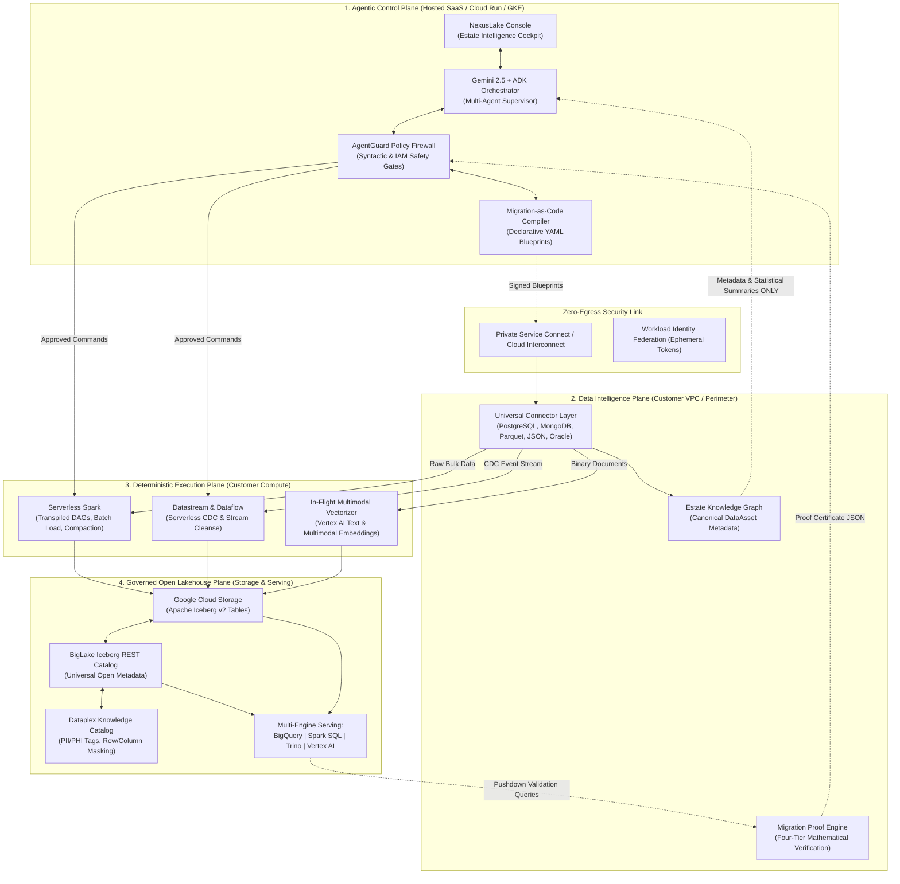

# NexusLake Agentic Architect: Enterprise Architectural Analysis & Proposal
**AI-Native Modernization of Heterogeneous Data Estates into an Open, Governed Apache Iceberg Lakehouse on Google Cloud**

*Document Version: 1.0.0 | Author: Antigravity AI Engine | Target: Google Cloud Lakehouse Sprint & Enterprise Marketplace*

---

## 1. Executive Summary & North Star

Enterprises are burdened by millions in legacy database licenses (Oracle Exadata, Teradata, Netezza, SQL Server), proprietary ETL scripts (Informatica, DataStage, SSIS), and unindexed unstructured media silos. Over 70% of legacy migrations fail or stall due to:
1. **Tribal business logic** hidden in proprietary procedural SQL (PL/SQL, BTEQ).
2. **Hidden circular dependencies** between tables and batch pipelines.
3. **The impossibility of petabyte-scale data validation** over WAN networks.
4. **Post-migration degradation** into unmanaged "data swamps" afflicted by small-file explosion, unpruned snapshots, and runaway query costs.

### The Product North Star
> **"NexusLake Agentic Architect transforms complex, heterogeneous enterprise data estates into an open, governed, AI-ready Apache Iceberg lakehouse on Google Cloud—and continuously modernizes, heals, and optimizes it for production workloads."**

### Core Architectural Axiom
- **Gemini 2.5 Pro/Flash & Google ADK** act strictly as the reasoning, semantic translation, planning, and root-cause analysis layer.
- **Deterministic Google Cloud Services** (Serverless Spark, Datastream, Dataflow, Cloud Storage, BigLake REST Catalog, BigQuery) execute all bulk data movement, transformations, and mathematical verifications.
- **Three Safety Rules:**
  1. LLMs NEVER move bulk data rows.
  2. LLMs NEVER execute destructive SQL without deterministic policy gating (AgentGuard).
  3. LLMs NEVER handle raw production credentials directly (managed via Secret Manager & Workload Identity Federation).

---

## 2. The Four-Plane Architecture

NexusLake decouples all platform responsibilities into four distinct planes:



---

## 3. Roster of Specialized Agents (12-Stage Lifecycle)

| Stage | Specialized Agent | Model | Operational Focus | Policy Gate |
| :--- | :--- | :--- | :--- | :--- |
| **1. Discover** | `EstateDiscoveryAgent` | Gemini 2.5 Flash | Metadata, schema, and storage crawler | Autonomous |
| **2. Assess** | `ComplexityAssessmentAgent` | Gemini 2.5 Flash | Risk scoring, TCO modeling, WAN bandwidth | Advisory review |
| **3. Understand** | `SemanticOntologyAgent` | Gemini 2.5 Pro | Business glossaries, entity resolution, lineage | Business review |
| **4. Decide** | `StrategyPlannerAgent` | Gemini 2.5 Pro | 10 migration patterns, wave dependency DAG | **MANDATORY ARCHITECT SIGN-OFF** |
| **5. Design** | `IcebergLayoutArchitect` | Gemini 2.5 Flash | Hidden partitions, Z-ordering, 256MB Parquet | Layout approval |
| **6. Clean** | `DataHygieneAgent` | Gemini 2.5 Flash | Anomaly detection, imputations, quarantine | Quarantine review |
| **7. Transform** | `PipelineTranspilerAgent` | Gemini 2.5 Pro | PL/SQL, BTEQ, T-SQL AST-to-PySpark translation | **EQUIVALENCE SUITE SIGN-OFF** |
| **8. Migrate** | `MigrationOrchestratorAgent` | Gemini 2.5 Flash | Serverless Spark batch loads & Datastream CDC | **MANDATORY CUTOVER APPROVAL** |
| **9. Validate** | `ReconciliationProofAgent` | Gemini 2.5 Flash | Four-tier mathematical & semantic proof engine | Zero-tolerance gate |
| **10. Govern** | `GovernanceSentinelAgent` | Gemini 2.5 Flash | Cloud DLP PII/PHI scan, Dataplex policy tags | Security review |
| **11. Operate** | `LakehouseSREAgent` | Gemini 2.5 Flash | Small file bin-packing, orphan cleanup, FinOps | Autonomous / Alerted |
| **12. Visualize**| `TelemetryInsightsAgent` | Gemini 2.5 Flash | Looker KPIs, natural language query console | Auto-refreshed |

---

## 4. The 10 Migration Strategies

1. **`REGISTER`:** Zero-copy metadata registration for existing cloud Parquet/ORC lakes.
2. **`REPLICATE`:** Direct parallel bulk load via Serverless Spark for static tables.
3. **`CDC`:** Continuous log-based replication via Datastream for live OLTP tables.
4. **`TRANSFORM`:** Structural and dialect code transpilation for legacy formats.
5. **`REWRITE`:** In-flight cleansing and sanitization for corrupted tables.
6. **`REPARTITION`:** Layout re-alignment (hidden partitions) to slash query scan costs.
7. **`AGGREGATE`:** Micro-batch aggregation for ultra-high-velocity raw telemetry.
8. **`ARCHIVE`:** Regulatory cold tiering to GCS Archive storage class.
9. **`VIRTUALIZE`:** External federation via BigLake for restricted operational stores.
10. **`EXCLUDE`:** Omission and retirement documentation for dead/obsolete tables.

---

## 5. AgentGuard Safety Boundary

```
[Agent Action Proposal]
          │
          ▼
[AgentGuard Firewall]
  ├── 1. Syntactic Inspection (Deny DROP, TRUNCATE, DELETE)
  ├── 2. IAM & Workload Identity Assertion (Verify ephemeral token)
  ├── 3. Data Classification Check (Enforce Dataplex policy tag masking)
  └── 4. Risk Classification Tiering
          │
          ├─► LOW (Profiling, dry runs, ROI compaction) ──► Autonomous Execution
          ├─► MEDIUM (Staging bucket creation)          ──► Autonomous + Webhook Alert
          ├─► HIGH (Column renames, transpiled DAGs)     ──► Mandatory 1 Human Sign-Off
          └─► CRITICAL (Cutover, legacy stop)           ──► Mandatory Multi-Sig Sign-Off
```

---

## 6. Four-Tier Migration Proof Engine

To ensure mathematical certifiability without petabyte WAN data movement:
- **Tier 1 (Structural):** SHA-256 schema fingerprinting (types, ordinals, nullability).
- **Tier 2 (Statistical):** In-engine pushdown HyperLogLog (HLL) cardinality & min/max bounds.
- **Tier 3 (Cryptographic):** In-engine partition-level Commutative XOR Merkle DAG hash check:
  $$\text{Hash}_{\text{block}} = \bigoplus_{i=1}^N \text{HMAC-SHA256}(\text{PK}_i \,\|\, \text{Col}_1 \,\|\, \dots \,\|\, \text{Col}_M)$$
- **Tier 4 (Semantic):** Autonomous execution of business KPI rollups diffed across engines.

---

## 7. Phased Implementation Roadmap

```
+-------------------------------------------------------------------------------------------------+
|                                 PHASED IMPLEMENTATION ROADMAP                                   |
+=================================================================================================+
| PHASE 1: SPRINT MVP VERTICAL SLICE (Competition Submission)                                     |
| * Connectors: PostgreSQL, MongoDB, Parquet, JSON                                                |
| * Pipeline: Discovery -> DataAsset -> Strategy Agent -> Spark -> Iceberg -> BigLake Catalog    |
| * Advanced Demo 1: Stored procedure transpiled to PySpark with automated test verification       |
| * Advanced Demo 2: Day-2 Lakehouse SRE compaction with FinOps ROI modeling                     |
| * Interface: Interactive Streamlit Web Console with DataAsset graph & Proof Certificate         |
+-------------------------------------------------------------------------------------------------+
                                                 │
                                                 ▼
+-------------------------------------------------------------------------------------------------+
| PHASE 2: ADVANCED ENTERPRISE EXPANSION                                                          |
| * Connectors: Oracle Exadata, Teradata BTEQ, Snowflake, Kafka streams                           |
| * Full 4-Tier Cryptographic Merkle Proof Engine                                                 |
| * Real-time CDC semantic drift classification and quarantine handling                           |
| * BigLake Object Tables with automated Vertex AI multimodal embeddings                          |
+-------------------------------------------------------------------------------------------------+
                                                 │
                                                 ▼
+-------------------------------------------------------------------------------------------------+
| PHASE 3: GOOGLE CLOUD MARKETPLACE COMMERCIALIZATION                                             |
| * Multi-tenant SaaS Control Plane hosted on Google Kubernetes Engine (GKE)                      |
| * In-Tenant Data Plane automated deployment via Terraform & Private Service Connect            |
| * Cloud Commerce Partner Procurement API integration (metering by PB processed)                 |
| * SOC2 Type II, HIPAA, and FedRAMP compliance certification                                     |
+-------------------------------------------------------------------------------------------------+
```
